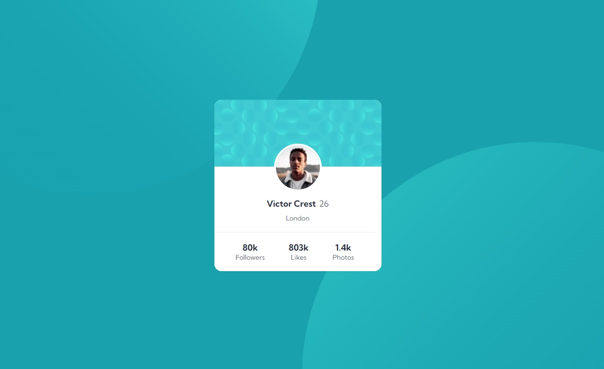

# Frontend Mentor - Profile card component

This is a solution to the [Profile card component challenge on Frontend Mentor](https://www.frontendmentor.io/challenges/profile-card-component-cfArpWshJ). Frontend Mentor challenges help you improve your coding skills by building realistic projects. 

### The challenge

Users should be able to:

- Build out the project to the designs provided

### Links

- Solution URL:https://github.com/markuscoding/profile-card-component-main
- Live Site URL:https://markuscoding.github.io/profile-card-component-main/

### Screenshot

## My process

### Built with

- Semantic HTML5 markup
- CSS custom properties
- Flexbox
- CSS Grid
- Mobile-first workflow

## Author

- Frontend Mentor - [@markuscoding](https://www.frontendmentor.io/profile/markuscoding)
- Github - [@markuscoding](https://github.com/markuscoding)
